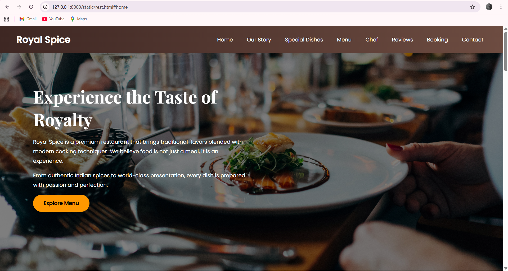

# Ex.06 Restaurant Website
## Date:19/12/25

## AIM:
To develop a static Restaurant website to display the food items and services provided by them.

## DESIGN STEPS:

### Step 1:
Requirement collection.

### Step 2:
Creating the layout using HTML and CSS.

### Step 3:
Updating the sample content.

### Step 4:
Choose the appropriate style and color scheme.

### Step 5:
Validate the layout in various browsers.

### Step 6:
Validate the HTML code.

### Step 7:
Publish the website in the given URL.

## PROGRAM:
```
<!DOCTYPE html>
<html lang="en">
<head>
    <meta charset="UTF-8">
    <title>Royal Spice Restaurant</title>
    <meta name="viewport" content="width=device-width, initial-scale=1.0">

    <!-- Google Font -->
    <link href="https://fonts.googleapis.com/css2?family=Playfair+Display:wght@400;600;700&family=Poppins:wght@300;400;500&display=swap" rel="stylesheet">

    <!-- CSS File -->
    <link rel="stylesheet" href="style.css">
</head>
<body>

<!-- ================= HEADER ================= -->
<header class="header">
    <div class="logo">Royal Spice</div>
    <nav>
        <ul>
            <li><a href="#home">Home</a></li>
            <li><a href="#story">Our Story</a></li>
            <li><a href="#special">Special Dishes</a></li>
            <li><a href="#menu">Menu</a></li>
            <li><a href="#chef">Chef</a></li>
            <li><a href="#reviews">Reviews</a></li>
            <li><a href="#booking">Booking</a></li>
            <li><a href="#contact">Contact</a></li>
        </ul>
    </nav>
</header>

<!-- ================= HERO ================= -->
<section id="home" class="hero">
    <div class="hero-text">
        <h1>Experience the Taste of Royalty</h1>
        <p>
            Royal Spice is a premium restaurant that brings traditional flavors
            blended with modern cooking techniques. We believe food is not just
            a meal, it is an experience.
        </p>
        <p>
            From authentic Indian spices to world-class presentation,
            every dish is prepared with passion and perfection.
        </p>
        <a href="#menu" class="btn">Explore Menu</a>
    </div>
</section>

<!-- ================= STORY ================= -->
<section id="story" class="section light">
    <h2>Our Story</h2>
    <p>
        Royal Spice was founded with a simple vision – to serve delicious food
        that connects people and cultures. Our journey began as a small family
        kitchen and grew into a fine dining restaurant loved by hundreds of customers.
    </p>
    <p>
        We focus on quality ingredients, hygienic cooking practices, and
        excellent customer service. Every guest is treated like royalty.
    </p>
    <p>
        Our restaurant ambiance is designed to provide comfort, elegance,
        and a warm dining atmosphere suitable for families, friends,
        and special occasions.
    </p>
</section>

<!-- ================= SPECIAL ================= -->
<section id="special" class="section dark">
    <h2>Today’s Specials</h2>

    <div class="special-grid">
        <div class="special-card">
            <h3>Royal Butter Chicken</h3>
            <p>
                A rich and creamy North Indian delicacy prepared with
                fresh spices and tender chicken pieces.
            </p>
            <span>₹420</span>
        </div>

        <div class="special-card">
            <h3>Paneer Maharaja</h3>
            <p>
                Soft paneer cubes cooked in a thick royal gravy
                infused with aromatic spices.
            </p>
            <span>₹360</span>
        </div>

        <div class="special-card">
            <h3>Hyderabadi Dum Biryani</h3>
            <p>
                Long-grain basmati rice layered with marinated meat
                and slow-cooked to perfection.
            </p>
            <span>₹480</span>
        </div>
    </div>
</section>

<!-- ================= MENU ================= -->
<section id="menu" class="section light">
    <h2>Our Menu</h2>

    <div class="menu-section">
        <h3>Starters</h3>
        <ul>
            <li>Chicken 65 <span>₹220</span></li>
            <li>Paneer Tikka <span>₹200</span></li>
            <li>Veg Spring Rolls <span>₹180</span></li>
            <li>Fish Fingers <span>₹240</span></li>
        </ul>
    </div>

    <div class="menu-section">
        <h3>Main Course</h3>
        <ul>
            <li>Butter Chicken <span>₹420</span></li>
            <li>Mutton Rogan Josh <span>₹520</span></li>
            <li>Veg Kadai <span>₹260</span></li>
            <li>Dal Tadka <span>₹220</span></li>
        </ul>
    </div>

    <div class="menu-section">
        <h3>Desserts</h3>
        <ul>
            <li>Gulab Jamun <span>₹120</span></li>
            <li>Chocolate Brownie <span>₹180</span></li>
            <li>Ice Cream Sundae <span>₹150</span></li>
        </ul>
    </div>
</section>

<!-- ================= CHEF ================= -->
<section id="chef" class="section dark">
    <h2>Meet Our Chef</h2>
    <p>
        Our head chef has over 15 years of experience in the culinary industry.
        He specializes in Indian and continental cuisine and believes
        that cooking is an art.
    </p>
    <p>
        Under his guidance, our kitchen follows strict quality standards
        and innovative cooking techniques.
    </p>
</section>

<!-- ================= REVIEWS ================= -->
<section id="reviews" class="section light">
    <h2>Customer Reviews</h2>

    <div class="review">
        <p>
            “Amazing food and beautiful ambiance. The biryani was outstanding!”
        </p>
        <span>– Arun Kumar</span>
    </div>

    <div class="review">
        <p>
            “Royal Spice truly lives up to its name. Excellent service and taste.”
        </p>
        <span>– Priya Sharma</span>
    </div>
</section>

<!-- ================= BOOKING ================= -->
<section id="booking" class="section dark">
    <h2>Table Reservation</h2>

    <form class="booking-form">
        <input type="text" placeholder="Customer Name">
        <input type="email" placeholder="Email Address">
        <input type="number" placeholder="Number of Guests">
        <input type="date">
        <textarea placeholder="Special Requests"></textarea>
        <button>Book Table</button>
    </form>
</section>

<!-- ================= CONTACT ================= -->
<section id="contact" class="section light">
    <h2>Contact Us</h2>
    <p>Email: royalspice@gmail.com</p>
    <p>Phone: +91 98765 43210</p>
    <p>Location: Chennai, Tamil Nadu</p>
</section>

<!-- ================= FOOTER ================= -->
<footer class="footer">
    <p>© 2025 Royal Spice Restaurant</p>
    <p>Designed for Academic Project</p>
</footer>

</body>
</html>

style.css

/* ============ GLOBAL ============ */
* {
    margin: 0;
    padding: 0;
    box-sizing: border-box;
}

body {
    font-family: 'Poppins', sans-serif;
    background: linear-gradient(135deg, #fff3e0, #ffe0b2);
    color: #3e2723;
}

h1, h2, h3 {
    font-family: 'Playfair Display', serif;
}

html {
    scroll-behavior: smooth;
}

/* ============ HEADER ============ */
.header {
    position: fixed;
    top: 0;
    width: 100%;
    background: linear-gradient(to right, #3e2723, #6d4c41);
    display: flex;
    justify-content: space-between;
    align-items: center;
    padding: 20px 50px;
    z-index: 1000;
}

.logo {
    color: #fff;
    font-size: 28px;
    font-weight: 700;
}

.header ul {
    list-style: none;
    display: flex;
    gap: 22px;
}

.header a {
    color: #fff;
    text-decoration: none;
    padding: 6px 10px;
    border-radius: 6px;
    transition: background 0.3s;
}

.header a:hover {
    background: rgba(255,255,255,0.2);
}

/* ============ HERO ============ */
.hero {
    height: 100vh;
    background: linear-gradient(
        rgba(0,0,0,0.5),
        rgba(0,0,0,0.5)
    ),
    url("https://images.unsplash.com/photo-1414235077428-338989a2e8c0");
    background-size: cover;
    background-position: center;
    display: flex;
    align-items: center;
    padding: 100px;
}

.hero-text {
    max-width: 650px;
    color: #fff;
}

.hero h1 {
    font-size: 52px;
    margin-bottom: 20px;
}

.hero p {
    line-height: 1.8;
    margin-bottom: 15px;
}

.btn {
    display: inline-block;
    padding: 14px 32px;
    background: #ff9800;
    color: #000;
    border-radius: 30px;
    font-weight: 600;
    text-decoration: none;
}

/* ============ SECTIONS ============ */
.section {
    padding: 120px 80px;
}

.light {
    background: #fff8f0;
}

.dark {
    background: linear-gradient(135deg, #efebe9, #d7ccc8);
}

.section h2 {
    font-size: 36px;
    margin-bottom: 25px;
}

.section p {
    line-height: 1.8;
    margin-bottom: 15px;
}

/* ============ SPECIAL ============ */
.special-grid {
    display: grid;
    grid-template-columns: repeat(auto-fit, minmax(220px, 1fr));
    gap: 25px;
}

.special-card {
    background: white;
    padding: 30px;
    border-radius: 18px;
    box-shadow: 0 12px 30px rgba(0,0,0,0.15);
}

.special-card span {
    font-weight: bold;
    color: #e65100;
}

/* ============ MENU ============ */
.menu-section {
    margin-bottom: 40px;
}

.menu-section ul {
    list-style: none;
}

.menu-section li {
    display: flex;
    justify-content: space-between;
    padding: 10px 0;
    border-bottom: 1px dashed #aaa;
}

/* ============ REVIEWS ============ */
.review {
    background: white;
    padding:
```

## OUTPUT:


 
 
 
 
 


## RESULT:
The program for designing software company website using HTML and CSS is completed successfully.
